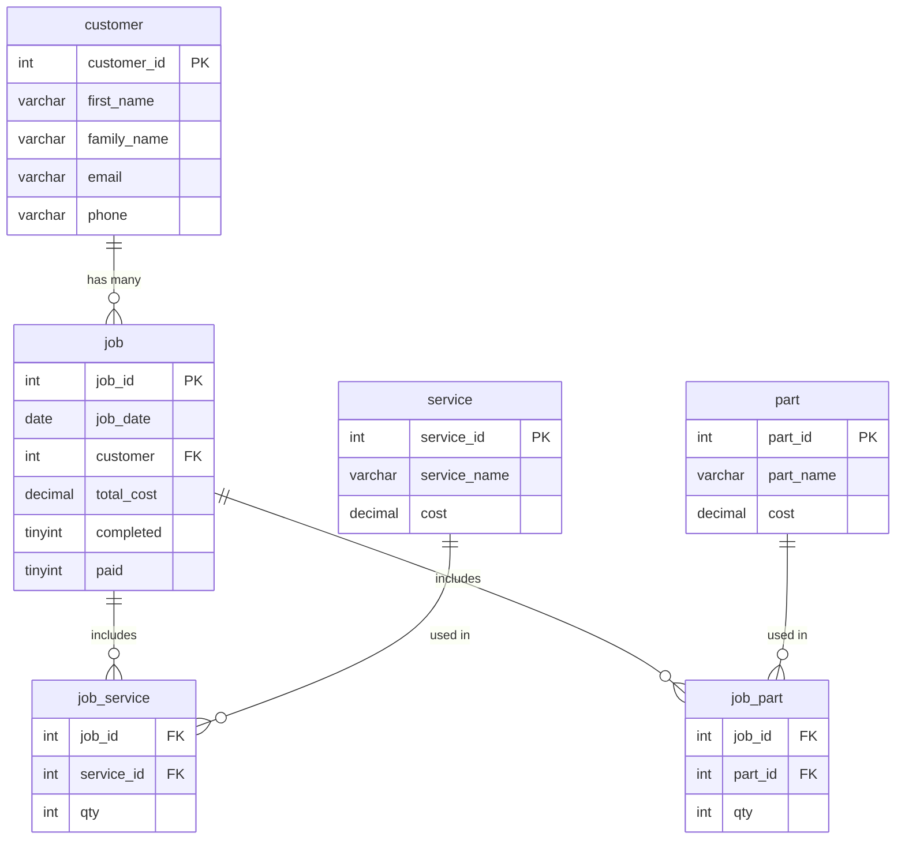
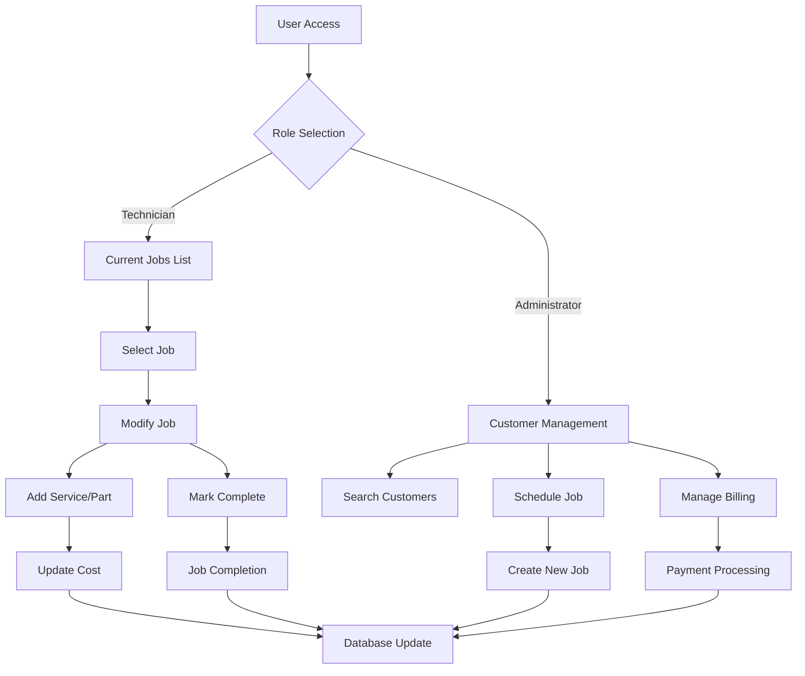

<div align="center"><a name="readme-top"></a>

[](#)

# 🚗 Selwyn Panel Beaters Online Service<br/><h3>Comprehensive Automotive Repair Management System</h3>

An innovative automotive repair shop management solution that leverages modern web technologies to provide streamlined operations and enhanced customer service.<br/>
Supports multi-user interfaces, real-time cost calculation, and comprehensive job tracking with an extensible and scalable architecture.<br/>
One-click **FREE** deployment of your automotive repair management platform.

[Official Demo][demo-link] · [Installation Guide][install-guide] · [Documentation][docs] · [Support][support-link] · [Issues][github-issues-link]

<br/>

[][demo-link]

<br/>

<!-- SHIELD GROUP -->

[![][github-release-shield]][github-release-link]
[![][python-shield]][python-link]
[![][flask-shield]][flask-link]
[![][mysql-shield]][mysql-link]<br/>
[![][license-shield]][license-link]
[![][contributors-shield]][contributors-link]
[![][github-stars-shield]][github-stars-link]
[![][github-forks-shield]][github-forks-link]
[![][github-issues-shield]][github-issues-link]<br>
[![][sponsor-shield]][sponsor-link]

**Share Project Repository**

[![][share-x-shield]][share-x-link]
[![][share-linkedin-shield]][share-linkedin-link]
[![][share-reddit-shield]][share-reddit-link]
[![][share-telegram-shield]][share-telegram-link]

<sup>🌟 Revolutionizing automotive repair shop management. Built for technicians, administrators, and business owners.</sup>

</div>

> [!TIP]
> This system provides separate interfaces for technicians and administrators, ensuring role-based access and streamlined workflow management.

## 📸 System Screenshots

> [!TIP]
> Experience the intuitive user interface designed for automotive repair professionals.

<div align="center">
  
  <p><em>System Overview - Complete workflow demonstration</em></p>
</div>

<div align="center">
  
  <p><em>Main Dashboard - Centralized navigation hub</em></p>
</div>

<div align="center">
  
  
  <p><em>Administrator Portal (left) and Technician Workspace (right)</em></p>
</div>

**Tech Stack Overview:**

<div align="center">

 
 
 
 
 
 

</div>

> [!IMPORTANT]
> This system demonstrates modern automotive repair management with dual-interface design. It combines Flask backend with MySQL database to provide comprehensive job tracking, customer management, and billing solutions. Features include real-time cost calculation, inventory management, and role-based access control.

<details>
<summary><kbd>📑 Table of Contents</kbd></summary>

#### TOC

- [🚗 Selwyn Panel Beaters Online ServiceComprehensive Automotive Repair Management System](#-selwyn-panel-beaters-online-servicecomprehensive-automotive-repair-management-system)
  - [📸 System Screenshots](#-system-screenshots)
      - [TOC](#toc)
      - [](#)
  - [🌟 Introduction](#-introduction)
  - [✨ Key Features](#-key-features)
    - [`1` Technician Workspace](#1-technician-workspace)
    - [`2` Administrator Portal](#2-administrator-portal)
    - [`*` Business Management](#-business-management)
  - [🛠️ Tech Stack](#️-tech-stack)
  - [🏗️ System Architecture](#️-system-architecture)
    - [Database Schema](#database-schema)
    - [Application Flow](#application-flow)
    - [Component Structure](#component-structure)
  - [⚡️ Performance](#️-performance)
    - [Key Metrics](#key-metrics)
  - [🚀 Getting Started](#-getting-started)
    - [Prerequisites](#prerequisites)
    - [Quick Installation](#quick-installation)
    - [Database Setup](#database-setup)
    - [Running the Application](#running-the-application)
  - [🛳 Deployment](#-deployment)
    - [`A` Local Deployment](#a-local-deployment)
    - [`B` Production Deployment](#b-production-deployment)
    - [`C` Configuration](#c-configuration)
  - [📖 Usage Guide](#-usage-guide)
    - [Technician Interface](#technician-interface)
    - [Administrator Interface](#administrator-interface)
    - [API Endpoints](#api-endpoints)
  - [🤝 Contributing](#-contributing)
  - [📄 License](#-license)
  - [👥 Author](#-author)

####

<br/>

</details>

## 🌟 Introduction

We are dedicated developers creating next-generation automotive repair management solutions. By adopting modern web technologies and intuitive design principles, we aim to provide repair shops with powerful, efficient, and user-friendly management tools.

Whether you're a technician managing repair jobs or an administrator overseeing business operations, this system will be your comprehensive automotive repair management platform. The system features role-based interfaces optimized for different user needs and workflows.

> [!NOTE]
> - Python 3.9+ required
> - MySQL 8.0+ database required
> - Web browser with modern JavaScript support
> - Network connectivity for real-time updates

| [![][demo-shield-badge]][demo-link]   | No installation required! Visit our live demo to experience the system firsthand.                           |
| :------------------------------------ | :----------------------------------------------------------------------------------------------------------- |
| [![][github-shield-badge]][github-link] | Join our community! Connect with automotive professionals and system developers. |

> [!TIP]
> **⭐ Star us** to receive all release notifications and updates from GitHub!

## ✨ Key Features

### `1` [Technician Workspace][docs-technician]

Experience streamlined job management designed specifically for automotive technicians. Our intuitive interface provides real-time access to repair jobs, service addition, and progress tracking.

**Core Capabilities:**
- 🔧 **Job Management**: View and manage current repair assignments
- ⚡ **Real-time Updates**: Live cost calculation and job status tracking
- 📋 **Service Addition**: Add services and parts with quantity control
- ✅ **Progress Tracking**: Mark jobs as completed with status validation
- 🎯 **User-friendly Interface**: Simplified workflow for efficient operations

> [!TIP]
> The technician interface is optimized for quick access to essential functions, allowing technicians to focus on repair work rather than administrative tasks.

### `2` [Administrator Portal][docs-administrator]

Comprehensive business management tools designed for automotive repair shop administrators. Monitor operations, manage customers, and track financial performance from a centralized dashboard.

**Administrative Features:**
- 👥 **Customer Management**: Complete customer database with search capabilities
- 📅 **Job Scheduling**: Assign repair jobs to specific dates and customers
- 💰 **Billing Management**: Track payments, overdue accounts, and financial status
- 📊 **Inventory Control**: Manage parts and services catalog with pricing
- 🔍 **Advanced Search**: Find customers and jobs with flexible filtering
- 📈 **Business Analytics**: Monitor job completion rates and payment status

### `*` Business Management

Beyond core features, the system includes comprehensive business tools:

- [x] 💨 **Quick Setup**: Deploy and configure in under 5 minutes
- [x] 🔄 **Real-time Sync**: Live updates across all interfaces
- [x] 🔒 **Data Security**: Secure database connections and data integrity
- [x] 💎 **Modern UI**: Bootstrap-powered responsive design
- [x] 📱 **Mobile Ready**: Responsive design for tablet and mobile access
- [x] 📊 **Cost Tracking**: Automated calculation of job costs
- [x] 🔌 **Extensible**: Modular design for custom feature addition
- [x] 💼 **Multi-user**: Separate interfaces for different user roles

> ✨ Additional features are continuously added based on industry needs and user feedback.

<div align="right">

[![][back-to-top]](#readme-top)

</div>

## 🛠️ Tech Stack

<div align="center">
  <table>
    <tr>
      <td align="center" width="96">
        
        <br>Python 3.9+
      </td>
      <td align="center" width="96">
        
        <br>Flask 3.0.1
      </td>
      <td align="center" width="96">
        
        <br>MySQL 8.3.0
      </td>
      <td align="center" width="96">
        
        <br>Bootstrap 5
      </td>
      <td align="center" width="96">
        
        <br>HTML5
      </td>
      <td align="center" width="96">
        
        <br>CSS3
      </td>
    </tr>
  </table>
</div>

**Backend Stack:**
- **Framework**: Flask 3.0.1 with Jinja2 templating
- **Language**: Python 3.9+ for robust server-side logic
- **Database**: MySQL 8.3.0 with mysql-connector-python
- **ORM**: Direct SQL queries with prepared statements
- **Session Management**: Flask session handling with secret keys

**Frontend Stack:**
- **Framework**: Bootstrap 5 for responsive design
- **Templating**: Jinja2 with template inheritance
- **Styling**: CSS3 with Bootstrap components
- **JavaScript**: Vanilla JS for interactive elements
- **UI Components**: Bootstrap navigation, forms, and tables

**Development Tools:**
- **Dependency Management**: pip with requirements.txt
- **Version Control**: Git with GitHub hosting
- **Database Tools**: MySQL Workbench compatible schema
- **Development Server**: Flask built-in development server

> [!TIP]
> Each technology was selected for reliability, ease of deployment, and maintenance efficiency in automotive repair environments.

## 🏗️ System Architecture

### Database Schema

The system uses a well-structured MySQL database designed for automotive repair operations:



### Application Flow



### Component Structure

```
automotive-repair-management-system/
├── app.py                 # Main Flask application
├── connect.py            # Database connection configuration
├── requirements.txt      # Python dependencies
├── spb_local.sql        # Database schema and sample data
├── templates/           # Jinja2 HTML templates
│   ├── base.html       # Base template with navigation
│   ├── currentjoblist.html          # Technician job list
│   ├── technician_modify_job.html   # Job modification interface
│   ├── administrator_customer_list.html    # Customer management
│   ├── administrator_pay_bills.html        # Payment management
│   └── administrator_overdue_bills.html    # Billing history
└── public/             # Static assets
    └── selwyn-panel-beaters-online.svg    # Logo and branding
```

## ⚡️ Performance

### Key Metrics

**Database Performance:**
- ⚡ **Query Optimization**: Indexed primary and foreign keys
- 🚀 **Connection Pooling**: Efficient MySQL connection management
- 💨 **Real-time Updates**: Live cost calculation and status tracking
- 📊 **Data Integrity**: ACID compliant transactions

**Application Performance:**
- 🎯 **Response Time**: < 200ms for typical operations
- 🔄 **Concurrent Users**: Supports multiple simultaneous users
- 💾 **Memory Efficiency**: Optimized Flask application structure
- 📱 **Mobile Performance**: Responsive design for all devices

**User Experience:**
- 🚀 **Fast Navigation**: Tabbed interface for quick access
- ⚡ **Instant Feedback**: Real-time form validation
- 🎨 **Intuitive Design**: Bootstrap-powered professional interface
- 📋 **Efficient Workflow**: Streamlined job management processes

> [!NOTE]
> Performance metrics based on typical automotive repair shop usage patterns with concurrent technician and administrator access.

## 🚀 Getting Started

### Prerequisites

> [!IMPORTANT]
> Ensure you have the following installed on your system:

- **Python 3.9+** ([Download](https://python.org/downloads/))
- **MySQL 8.0+** ([Download](https://dev.mysql.com/downloads/))
- **Git** ([Download](https://git-scm.com/downloads))
- **Web Browser** (Chrome, Firefox, Safari, or Edge)

### Quick Installation

**1. Clone Repository**

```bash
git clone https://github.com/ChanMeng666/automotive-repair-management-system.git
cd automotive-repair-management-system
```

**2. Install Dependencies**

```bash
# Create virtual environment (recommended)
python -m venv venv

# Activate virtual environment
# On Windows:
venv\Scripts\activate
# On macOS/Linux:
source venv/bin/activate

# Install required packages
pip install -r requirements.txt
```

**3. Database Setup**

```bash
# Connect to MySQL as root user
mysql -u root -p

# Create database and import schema
mysql -u root -p < spb_local.sql
```

**4. Configure Environment Variables**

Copy the example environment file and configure your settings:

```bash
cp .env.example .env
```

Edit `.env` with your configuration:

```bash
# Flask Configuration
FLASK_ENV=development
SECRET_KEY=your-secure-secret-key-generate-one-for-production

# Database Configuration
DB_HOST=localhost
DB_PORT=3306
DB_USER=your_mysql_username
DB_PASSWORD=your_mysql_password
DB_NAME=spb

# Authentication (for development only)
AUTH_DEMO_MODE=true
DEMO_PASSWORD=your_demo_password
```

> **Security Note**: Never commit your `.env` file to version control. Generate a secure secret key for production using: `python -c "import secrets; print(secrets.token_hex(32))"`

**5. Run Application**

```bash
python run.py
```

> **Note**: The legacy `app.py` is deprecated. Please use `run.py` as the application entry point.

🎉 **Success!** Open [http://localhost:5000](http://localhost:5000) to access the system.

### Database Setup

**Database Schema Overview:**

The system includes pre-configured sample data:
- **Customers**: 6 sample customer records
- **Services**: 8 automotive services (Sandblast, Fill, Respray, etc.)
- **Parts**: 7 common parts (Windscreen, Headlight, Fender, etc.)
- **Jobs**: Sample repair jobs with various completion statuses

**Custom Configuration:**

```sql
-- Add your own services
INSERT INTO service (service_name, cost) VALUES ('Custom Service', 99.99);

-- Add your own parts
INSERT INTO part (part_name, cost) VALUES ('Custom Part', 149.99);

-- Add your customers
INSERT INTO customer (first_name, family_name, email, phone) 
VALUES ('John', 'Doe', 'john@example.com', '1234567890');
```

### Running the Application

**Development Mode:**

```bash
# Standard development server
python app.py

# With debug mode (for development)
export FLASK_ENV=development  # Linux/macOS
set FLASK_ENV=development     # Windows
python app.py
```

**Production Considerations:**

```bash
# Use production WSGI server
pip install gunicorn
gunicorn -w 4 -b 0.0.0.0:5000 app:app
```

## 🛳 Deployment

### `A` Local Deployment

**Single Machine Setup:**

```bash
# Install system dependencies
sudo apt-get update
sudo apt-get install python3 python3-pip mysql-server

# Clone and setup application
git clone https://github.com/ChanMeng666/automotive-repair-management-system.git
cd automotive-repair-management-system
pip3 install -r requirements.txt

# Configure MySQL
sudo mysql_secure_installation
mysql -u root -p < spb_local.sql

# Run application
python3 app.py
```

### `B` Production Deployment

**Web Server Configuration:**

```nginx
# nginx configuration
server {
    listen 80;
    server_name your-domain.com;
    
    location / {
        proxy_pass http://127.0.0.1:5000;
        proxy_set_header Host $host;
        proxy_set_header X-Real-IP $remote_addr;
    }
}
```

**Systemd Service:**

```ini
# /etc/systemd/system/automotive-repair.service
[Unit]
Description=Automotive Repair Management System
After=network.target

[Service]
User=www-data
WorkingDirectory=/path/to/automotive-repair-management-system
ExecStart=/path/to/venv/bin/gunicorn -w 4 -b 127.0.0.1:5000 app:app
Restart=always

[Install]
WantedBy=multi-user.target
```

### `C` Configuration

**Environment Variables:**

| Variable | Description | Required | Default | Example |
|----------|-------------|----------|---------|---------|
| `DB_USER` | MySQL username | ✅ | - | `repair_user` |
| `DB_PASS` | MySQL password | ✅ | - | `secure_password` |
| `DB_HOST` | MySQL host | 🔶 | `localhost` | `db.example.com` |
| `DB_NAME` | Database name | 🔶 | `spb` | `automotive_repair` |
| `SECRET_KEY` | Flask secret key | ✅ | - | `your-secret-key-here` |
| `FLASK_ENV` | Environment mode | 🔶 | `production` | `development` |

> [!NOTE]
> ✅ Required, 🔶 Optional

**Security Configuration:**

```python
# app.py security settings
app.config['SECRET_KEY'] = os.environ.get('SECRET_KEY', 'fallback-secret-key')
app.config['SESSION_COOKIE_SECURE'] = True  # For HTTPS
app.config['SESSION_COOKIE_HTTPONLY'] = True
app.config['PERMANENT_SESSION_LIFETIME'] = timedelta(hours=1)
```

## 📖 Usage Guide

### Technician Interface

**Accessing Current Jobs:**

1. **Navigate to Technician Home** from the main dashboard
2. **View Current Jobs List** showing all incomplete repair jobs
3. **Select a Job** to modify by clicking the radio button and "Modify" button

**Modifying Jobs:**

```python
# Job modification capabilities:
- Add services with quantity specification
- Add parts with quantity specification  
- Mark jobs as completed (irreversible action)
- View real-time cost calculations
```

**Adding Services and Parts:**

```html
<!-- Service Addition Form -->
<select name="service_id" required>
    <option value="1">Sandblast (Cost: $300.21)</option>
    <option value="2">Minor Fill (Cost: $43.21)</option>
    <!-- Additional services -->
</select>
<input type="number" name="service_qty" min="1" required>
```

### Administrator Interface

**Customer Management:**

```python
# Customer search and management features:
- Search by first name or family name
- Add new customers with contact information
- Schedule repair jobs for existing customers
- View customer job history
```

**Billing and Payment Management:**

1. **Unpaid Bills**: View all completed jobs awaiting payment
2. **Payment Processing**: Mark jobs as paid with confirmation
3. **Overdue Bills**: Monitor jobs past due date with detailed history
4. **Billing Analytics**: Track payment patterns and outstanding amounts

**Inventory Management:**

```sql
-- Add new services
INSERT INTO service (service_name, cost) VALUES ('New Service', 150.00);

-- Add new parts  
INSERT INTO part (part_name, cost) VALUES ('New Part', 75.50);
```

### API Endpoints

**Core Application Routes:**

| Method | Endpoint | Description | Parameters |
|--------|----------|-------------|------------|
| `GET` | `/` | Main dashboard | - |
| `GET/POST` | `/currentjoblist` | Technician job list | `page` (optional) |
| `GET/POST` | `/job/<int:job_id>` | Job modification interface | `job_id` |
| `POST` | `/add_service_to_job/<int:job_id>` | Add service to job | `service_id`, `service_qty` |
| `POST` | `/add_part_to_job/<int:job_id>` | Add part to job | `part_id`, `part_qty` |
| `POST` | `/job/<int:job_id>/mark_as_completed` | Mark job complete | `job_id` |
| `GET/POST` | `/administrator_customer_list` | Customer management | `customer_search`, `search_text` |
| `POST` | `/schedule_job` | Schedule new job | `customer_select`, `job_date` |
| `POST` | `/add_customer` | Add new customer | `first_name`, `family_name`, `email`, `phone` |

**Database Query Examples:**

```python
# Get current jobs with customer information
cursor.execute("""
    SELECT c.customer_id, c.first_name, c.family_name, 
           j.job_id, j.job_date, j.total_cost, j.completed, j.paid 
    FROM customer AS c 
    JOIN job AS j ON c.customer_id = j.customer 
    WHERE j.completed = 0 
    ORDER BY c.first_name, c.family_name, j.job_date DESC
""")

# Calculate job total cost
cursor.execute("""
    SELECT SUM(js.qty * s.cost) + SUM(jp.qty * p.cost) AS total_cost
    FROM job_service js 
    JOIN service s ON js.service_id = s.service_id
    JOIN job_part jp ON js.job_id = jp.job_id
    JOIN part p ON jp.part_id = p.part_id
    WHERE js.job_id = %s
""", (job_id,))
```

## 🤝 Contributing

We welcome contributions from automotive professionals and developers! Here's how you can help improve the system:

**Ways to Contribute:**
- 🐛 **Bug Reports**: Report issues with detailed reproduction steps
- 💡 **Feature Requests**: Suggest new functionality for automotive repair shops  
- 📚 **Documentation**: Improve installation guides and user manuals
- 🔧 **Code Contributions**: Submit pull requests with new features or fixes
- 🎨 **UI/UX Improvements**: Enhance the user interface and experience

**Development Process:**

```bash
# Fork and clone the repository
git clone https://github.com/your-username/automotive-repair-management-system.git
cd automotive-repair-management-system

# Create feature branch
git checkout -b feature/amazing-feature

# Make your changes and test thoroughly
python app.py  # Test locally

# Commit and push
git commit -m "Add amazing feature for automotive shops"
git push origin feature/amazing-feature

# Create Pull Request on GitHub
```

**Coding Standards:**
- Follow PEP 8 for Python code formatting
- Use meaningful variable and function names
- Add comments for complex business logic
- Test all database operations thoroughly
- Ensure responsive design compatibility

## 📄 License

This project is licensed under the MIT License - see the [LICENSE](LICENSE) file for details.

**Open Source Benefits:**
- ✅ Commercial use allowed for automotive businesses
- ✅ Modification allowed for custom requirements
- ✅ Distribution allowed for multi-location shops
- ✅ Private use allowed for internal development

## 👥 Author

<div align="center">
  <table>
    <tr>
      <td align="center">
        <a href="https://github.com/ChanMeng666">
          
          <br />
          <sub><b>Chan Meng</b></sub>
        </a>
        <br />
        <small>Creator & Lead Developer</small>
      </td>
    </tr>
  </table>
</div>

**Chan Meng**
-  LinkedIn: [chanmeng666](https://www.linkedin.com/in/chanmeng666/)
-  GitHub: [ChanMeng666](https://github.com/ChanMeng666)
-  Email: [chanmeng.dev@gmail.com](mailto:chanmeng.dev@gmail.com)
-  Website: [chanmeng.live](https://2d-portfolio-eta.vercel.app/)

**Contact Information:**
- 📧 **Support**: [chanmeng.dev@gmail.com](mailto:chanmeng.dev@gmail.com)
- 🐛 **Bug Reports**: [GitHub Issues](https://github.com/ChanMeng666/automotive-repair-management-system/issues)
- 💡 **Feature Requests**: [GitHub Discussions](https://github.com/ChanMeng666/automotive-repair-management-system/discussions)

---

<div align="center">
<strong>🚗 Driving the Future of Automotive Repair Management 🔧</strong>
<br/>
<em>Empowering repair shops with modern technology solutions</em>
<br/><br/>

⭐ **Star us on GitHub** • 📖 **Read the Documentation** • 🐛 **Report Issues** • 💡 **Request Features** • 🤝 **Contribute**

<br/><br/>

**Made with ❤️ for the automotive repair industry**


</div>

---

<!-- LINK DEFINITIONS -->

[back-to-top]: https://img.shields.io/badge/-BACK_TO_TOP-151515?style=flat-square

<!-- Project Links -->
[demo-link]: https://chanmeng.pythonanywhere.com/
[install-guide]: #-getting-started
[docs]: #-usage-guide
[support-link]: mailto:ChanMeng666@outlook.com
[docs-technician]: #technician-interface
[docs-administrator]: #administrator-interface

<!-- GitHub Links -->
[github-issues-link]: https://github.com/ChanMeng666/automotive-repair-management-system/issues
[github-stars-link]: https://github.com/ChanMeng666/automotive-repair-management-system/stargazers
[github-forks-link]: https://github.com/ChanMeng666/automotive-repair-management-system/forks
[contributors-link]: https://github.com/ChanMeng666/automotive-repair-management-system/contributors
[github-release-link]: https://github.com/ChanMeng666/automotive-repair-management-system/releases
[github-link]: https://github.com/ChanMeng666/automotive-repair-management-system
[license-link]: https://github.com/ChanMeng666/automotive-repair-management-system/blob/main/LICENSE

<!-- Technology Links -->
[python-link]: https://python.org
[flask-link]: https://flask.palletsprojects.com
[mysql-link]: https://mysql.com

<!-- Community Links -->
[sponsor-link]: https://github.com/sponsors/ChanMeng666

<!-- Shield Badges -->
[github-release-shield]: https://img.shields.io/github/v/release/ChanMeng666/automotive-repair-management-system?color=369eff&labelColor=black&logo=github&style=flat-square
[python-shield]: https://img.shields.io/badge/python-3.9+-blue?style=flat-square&logo=python&logoColor=white
[flask-shield]: https://img.shields.io/badge/Flask-3.0.1-black?style=flat-square&logo=flask&logoColor=white
[mysql-shield]: https://img.shields.io/badge/MySQL-8.3.0-blue?style=flat-square&logo=mysql&logoColor=white
[license-shield]: https://img.shields.io/badge/license-MIT-brightgreen?style=flat-square
[contributors-shield]: https://img.shields.io/github/contributors/ChanMeng666/automotive-repair-management-system?color=c4f042&labelColor=black&style=flat-square
[github-forks-shield]: https://img.shields.io/github/forks/ChanMeng666/automotive-repair-management-system?color=8ae8ff&labelColor=black&style=flat-square
[github-stars-shield]: https://img.shields.io/github/stars/ChanMeng666/automotive-repair-management-system?color=ffcb47&labelColor=black&style=flat-square
[github-issues-shield]: https://img.shields.io/github/issues/ChanMeng666/automotive-repair-management-system?color=ff80eb&labelColor=black&style=flat-square
[sponsor-shield]: https://img.shields.io/badge/-Sponsor%20Project-f04f88?logo=github&logoColor=white&style=flat-square

<!-- Badge Variants -->
[demo-shield-badge]: https://img.shields.io/badge/TRY%20DEMO-ONLINE-55b467?labelColor=black&logo=vercel&style=for-the-badge
[github-shield-badge]: https://img.shields.io/badge/JOIN%20COMMUNITY-GITHUB-black?labelColor=black&logo=github&style=for-the-badge

<!-- Social Share Links -->
[share-x-link]: https://x.com/intent/tweet?hashtags=automotive,repairshop,opensource&text=Check%20out%20this%20amazing%20automotive%20repair%20management%20system&url=https%3A%2F%2Fgithub.com%2FChanMeng666%2Fautomotive-repair-management-system
[share-linkedin-link]: https://linkedin.com/sharing/share-offsite/?url=https://github.com/ChanMeng666/automotive-repair-management-system
[share-reddit-link]: https://www.reddit.com/submit?title=Automotive%20Repair%20Management%20System&url=https%3A%2F%2Fgithub.com%2FChanMeng666%2Fautomotive-repair-management-system
[share-telegram-link]: https://t.me/share/url?text=Check%20out%20this%20automotive%20repair%20system&url=https%3A%2F%2Fgithub.com%2FChanMeng666%2Fautomotive-repair-management-system

[share-x-shield]: https://img.shields.io/badge/-share%20on%20x-black?labelColor=black&logo=x&logoColor=white&style=flat-square
[share-linkedin-shield]: https://img.shields.io/badge/-share%20on%20linkedin-black?labelColor=black&logo=linkedin&logoColor=white&style=flat-square
[share-reddit-shield]: https://img.shields.io/badge/-share%20on%20reddit-black?labelColor=black&logo=reddit&logoColor=white&style=flat-square
[share-telegram-shield]: https://img.shields.io/badge/-share%20on%20telegram-black?labelColor=black&logo=telegram&logoColor=white&style=flat-square
